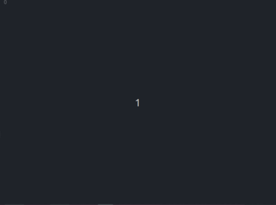
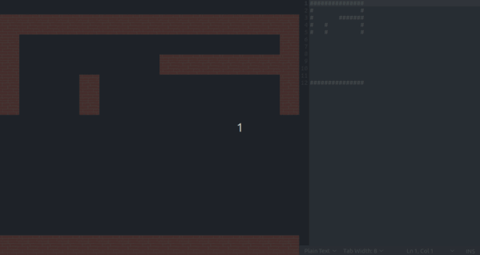
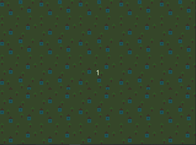
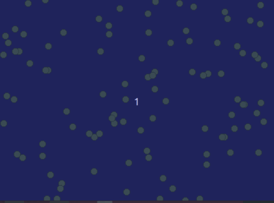
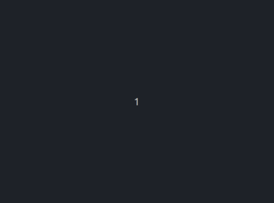
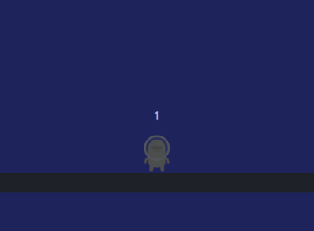
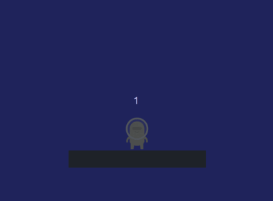
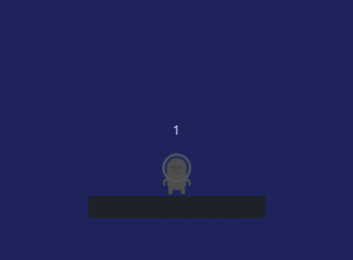

# PyGame Zero Game Snippets

## Prerequisites
### Install PyGameZero
### Libraries
### Game Assets
### Create A Tile Map

## Generic
### Generic Template

``` py
import pgzrun

# define window WIDTH and HEIGHT
WIDTH = 800
HEIGHT = 600

# generate Actors who are the objects in the game
actor_object1 = Actor("actor_name1")
actor_object2 = Actor("actor_name2")

# place the actors in the space
actor_object1.x = 10
actor_object1.y = 10

actor_object2.x = 20
actor_object2.y = 20

# draw the actor objects on the screen
# draw background and other stuff
def draw():
    screen.clear()
    screen.fill("skyblue")

    actor_object1.draw()
    actor_object2.draw()

# define actions for the object actors
def update():
    pass


pgzrun.go() 

```

## Screen Draw
### Draw stuff on screen

``` py
def draw():
    # clears screen
    screen.clear()
    # colors ENTIRE screen
    screen.fill("skyblue")
    # draw a rectangle at some coordinates
    screen.draw.filled_rect(Rect(0,0,800,400), (253, 200, 254))
```
??? Code
    ``` py
    import pgzrun

    # define window WIDTH and HEIGHT
    WIDTH = 800
    HEIGHT = 600

    def draw():
        # clears screen
        screen.clear()
        # colors ENTIRE screen
        screen.fill("skyblue")

        # draw a rectangle at some coordinates
        # Rect (0,0,800,400) -- rectangle position and width and height
        # (253, 200, 254) -- rectangle collor
        screen.draw.filled_rect(Rect(0,0,800,400), (253, 200, 254))

    pgzrun.go()
    ```
### Draw a background image
``` py
background = Actor('background')
background.x = 400
background.y = 300

def draw():
    background.draw()

```
??? Code
    ``` py
    import pgzrun

    # define window WIDTH and HEIGHT
    WIDTH = 800
    HEIGHT = 600
    
    background = Actor('background')
    background.x = 400
    background.y = 300

    def draw():
        background.draw()

    pgzrun.go()
    ```

### Show the score on the screen

``` py
score=0

def draw():
    global score
    screen.clear()
    screen.draw.text(str(score),topleft=(10,10))
def update():
    global score
    if condition:
        score = score + 1

```
??? Code
    ``` py
    import pgzrun

    # define window WIDTH and HEIGHT
    WIDTH = 800
    HEIGHT = 600
    score = 0

    def draw():
        global score
        screen.clear()
        screen.draw.text(str(score),topleft=(10,10))

    def update():
        global score
        if keyboard.up:
            score = score + 1
        elif keyboard.down:
            score = score - 1


    pgzrun.go()
    ```

### Create labirinth from file
``` py
# Load map from file
def load_map(filename):
    with open(filename, 'r') as f:
        return [line.strip() for line in f.readlines()]

# Create wall actors based on map data
def create_walls(map_data):
    walls = []
    for y, row in enumerate(map_data):
        for x, char in enumerate(row):
            if char == '#':
                wall = Actor('wall')
                wall.x = x * TILE_SIZE + TILE_SIZE // 2
                wall.y = y * TILE_SIZE + TILE_SIZE // 2 + TILE_OFFSET_Y
                walls.append(wall)
    return walls

# Load the map and create wall actors
map_data = load_map(MAP_FILE)
walls = create_walls(map_data)

WIDTH = max(len(row) for row in map_data) * TILE_SIZE
HEIGHT = len(map_data) * TILE_SIZE + TILE_OFFSET_Y

def draw():
    screen.clear()
    for wall in walls:
        wall.draw()
```
??? Code
    ``` py
    import pgzrun

    MAP_FILE = 'map.txt'
    TILE_SIZE = 50
    TILE_OFFSET_Y = 50

    # Load map from file
    def load_map(filename):
        with open(filename, 'r') as f:
            return [line.strip() for line in f.readlines()]

    # Create wall actors based on map data
    def create_walls(map_data):
        walls = []
        for y, row in enumerate(map_data):
            for x, char in enumerate(row):
                if char == '#':
                    wall = Actor('wall')
                    wall.x = x * TILE_SIZE + TILE_SIZE // 2
                    wall.y = y * TILE_SIZE + TILE_SIZE // 2 + TILE_OFFSET_Y
                    walls.append(wall)
        return walls

    # Load the map and create wall actors
    map_data = load_map(MAP_FILE)
    walls = create_walls(map_data)

    WIDTH = max(len(row) for row in map_data) * TILE_SIZE
    HEIGHT = len(map_data) * TILE_SIZE + TILE_OFFSET_Y

    def draw():
        screen.clear()
        for wall in walls:
            wall.draw()


    pgzrun.go()
    ```
### Create random labirinth map
``` py
walls = []

for x in range(16):
    for y in range(10):
        if random.randint(0, 100) < 50:
            wall = Actor('wall')
            wall.x = x * 50 + 25
            wall.y = y * 50 + 25 + 50
            walls.append(wall)

def draw():
    for wall in walls:
        wall.draw()
```
??? Code
    ``` py
    import pgzrun
    import random

    TILE_SIZE = 50
    TILE_OFFSET_Y = 50
    WIDTH = 800
    HEIGHT = 600

    walls = []
    for x in range(16):
        for y in range(10):
            if random.randint(0, 100) < 50:
                wall = Actor('wall')
                wall.x = x * TILE_SIZE + TILE_SIZE // 2
                wall.y = y * TILE_SIZE + TILE_SIZE // 2 + TILE_OFFSET_Y
                walls.append(wall)


    def draw():
        screen.clear()
        for wall in walls:
            wall.draw()


    pgzrun.go()
    ```

### Moving Background
```py

# Create list of backgrounds first
# each background with a x and y
background_images = ['background']
backgrounds = []

background = Actor(random.choice(background_images))
background.x = 400
background.y = 300
backgrounds.append(background)

background = Actor(random.choice(background_images))
background.x = 400
background.y = -300
backgrounds.append(background)

## move the backgrounds.
def update():
    for background in backgrounds:
        background.y += 3
        # If one bakground finished going down, make it go up
        if background.y > 900:
            background.y -= 1200
            # change the image of the background if you want ( but it s the same backround that has finished and now it s up)
            background.image = random.choice(background_images)
def draw():
    screen.clear()
    for background in backgrounds:
        background.draw()

```

??? Code
    ```py
    import pgzrun
    import random

    WIDTH=800
    HEIGHT=600


    background_images = ['background']
    backgrounds = []

    background = Actor(random.choice(background_images))
    background.x = 400
    background.y = 300
    backgrounds.append(background)

    background = Actor(random.choice(background_images))
    background.x = 400
    background.y = -300
    backgrounds.append(background)


    def update():
        for background in backgrounds:
            background.y += 3
            if background.y > 900:
                background.y -= 1200
                background.image = random.choice(background_images)
    def draw():
        screen.clear()
        for background in backgrounds:
            background.draw()

    pgzrun.go() 
    ```

### Snow effect
```py
dot_list = []
for i in range(DOT_NUMBERS):
    dot_list.append(Actor ("dot"))
    dot_list[i].x = random.randint(10, 800)
    dot_list[i].y = random.randint(10, 600)

velocity_dot = 5

def update():
    
    global velocity_dot

    for i in range(DOT_NUMBERS):
        dot_list[i].y += velocity_dot
        if dot_list[i].y > 600:
            dot_list[i].y = 10

def draw():
    screen.fill("blue")
    for i in range(DOT_NUMBERS):
        dot_list[i].draw()
```

??? Code
    ```py
    import pgzrun
    import random

    WIDTH=800 
    HEIGHT=600

    DOT_NUMBERS = 100

    dot_list = []
    for i in range(DOT_NUMBERS):
        dot_list.append(Actor ("dot"))
        dot_list[i].x = random.randint(10, 800)
        dot_list[i].y = random.randint(10, 600)

    velocity_dot = 5

    def update():
        global velocity_dot

        for i in range(DOT_NUMBERS):
            dot_list[i].y += velocity_dot
            if dot_list[i].y > 600:
                dot_list[i].y = 10

    def draw():
        screen.fill("blue")
        for i in range(DOT_NUMBERS):
            dot_list[i].draw()

    pgzrun.go()
    ```

### Game Over Screen
```py
game_over = Actor('game_over')
game_over.x = 400
game_over.y = 300
game_state=0


def update():
    global game_state
    if keyboard.up:
        game_state = 1

def draw():
    screen.clear()
    
    if game_state == 0:
        #draw normal stuff
        pass
    if game_state == 1:
        game_over.draw()
```
??? Code
    ```py
    import pgzrun

    WIDTH=800
    HEIGHT=600

    game_over = Actor('game_over')
    game_over.x = 400
    game_over.y = 300
    game_state=0


    def update():
        global game_state
        if keyboard.up:
            game_state = 1

    def draw():
        screen.clear()
        
        if game_state == 0:
            #draw normal stuff
            pass
        if game_state == 1:
            game_over.draw()

    pgzrun.go() 
    ```

## Movement

### Actor Generic Left Right Movement

``` py
def update():
    ....
    if keyboard.left:
        player.x -= 2
        player.image="p_left"
        if player.x<10:
            player.x=10

    elif keyboard.right:
        player.x += 2
        player.image="p_right"
        if player.x>WIDTH-10:
            player.x=WIDTH-10  
    ....
```
??? Code
    ``` py
    import pgzrun
    import random

    WIDTH=800 
    HEIGHT=600

    DOT_NUMBERS = 100

    alien = Actor("alienbeige")
    alien.x = 400
    alien.y = 400


    def update():
    
        alien.image="alienbeige"
        if keyboard.right:
            alien.x += 5
            alien.image="alienbeige_walk_right"
            if alien.x>WIDTH-10:
                alien.x=WIDTH-10

        if keyboard.left:
            alien.x -= 5
            alien.image="alienbeige_walk_left"
            if alien.x<10:
                alien.x=10

    def draw():
        screen.fill("blue")
        screen.draw.filled_rect(Rect(0,450,800,50), (0,0,0))
        alien.draw()

    pgzrun.go()
    ```

### Actor Generic Jump Movement

``` py
velocity_y = 0
gravity = 1
jump = 0
...
def update():

    global velocity_y
    global jump
    ....
    if keyboard.up:
        if jump == 0:
            velocity_y = -15
            jump = 1
    
    # how much can you go down. this where the jump stops
    if actor_object.y > GROUND_Y :
        velocit_y = 0
        jump = 0
        actor_object.y = GROUND_Y

    # how much can you go up
    if actor_object.y < 0:
        actor_object.y = 0

    # at the beginig velocity is negative so the actor goes up. Then it becomes positive and it goes down
    actor_object.y += velocity_y 
    velocity += gravity
    ....
```

??? Code
    ```py
    import pgzrun
    import random

    WIDTH=800 
    HEIGHT=600

    DOT_NUMBERS = 100

    alien = Actor("alienbeige")
    alien.x = 400
    alien.y = 400

    velocity_y = 0
    gravity = 1
    jump = 0


    def update():
        
        global velocity_y
        global jump
        
        alien.image="alienbeige"

        if keyboard.up:
            if jump == 0:
                velocity_y = -15
                alien.image="alienbeige_jump"
                jump = 1
        
        if alien.y > 400:
            velocity_y = 0
            jump = 0
            alien.y = 400

        if alien.y < 0:
            alien.y = 0

        alien.y += velocity_y
        velocity_y += gravity

    def draw():
        screen.fill("blue")
        screen.draw.filled_rect(Rect(200,450,400,50), (0,0,0))
        alien.draw()


    pgzrun.go()
    ```

### Generic Full Movement
??? Code
    ```py
    import pgzrun
    import random

    WIDTH=800 
    HEIGHT=600

    DOT_NUMBERS = 100

    alien = Actor("alienbeige")
    alien.x = 400
    alien.y = 400

    velocity_y = 0
    gravity = 1
    jump = 0


    def update():
        
        global velocity_y
        global jump
        
        alien.image="alienbeige"

        if keyboard.right:
            alien.x += 5
            alien.image="alienbeige_walk_right"
            if alien.x>WIDTH-10:
                alien.x=WIDTH-10

        if keyboard.left:
            alien.x -= 5
            alien.image="alienbeige_walk_left"
            if alien.x<10:
                alien.x=10

        if keyboard.up:
            if jump == 0:
                velocity_y = -15
                alien.image="alienbeige_jump"
                jump = 1
        
        if alien.y > 400:
            velocity_y = 0
            jump = 0
            alien.y = 400

        if alien.y < 0:
            alien.y = 0

        alien.y += velocity_y
        velocity_y += gravity

    def draw():
        screen.fill("blue")
        screen.draw.filled_rect(Rect(200,450,400,50), (0,0,0))
        alien.draw()


    pgzrun.go()
    ```
### Animation


## Collison
### Collide Stuff simple

``` py
def update():

    coin_collected=actor1.colliderect(actor_collectable1)
    red_coin_collected=actor2.colliderect(actor_collectable2)

    if coin_collected:
        ...

    if red_coin_collected:
        ...

```

### Collide stuff multiple

``` py
def update():
    ....
    for actor in actor_list:
        
        index = actor.collidelist(actor_list2)
            if index != -1:
                del actor_list2[index]
```

### Collect simple

``` py
def update():
    global score
    global coin_collected_nr
    global RED_COIN_DRAW

    coin_collected=fox.colliderect(coin)
    red_coin_collected=fox.colliderect(red_coin)


    if coin_collected:
        score=score+10
        coin_collected_nr=coin_collected_nr+1
        place_coin()

    if red_coin_collected:
        score=score+30
        delete_red_coin()

```


## Shooting
### Shooting1
``` py
bullets = []
bullet_holdoff = 0

def draw():

    for bullet in bullets:
        bullet.draw()

def update():
    ....
    ....

    ## create new bullet after pressing space
    ## make sure there is a hold off to not spam the bullets
    if bullet_holdoff == 0:
        if keyboard.space:
            bullet = Actor('bulletblue2')
            bullet.angle = tank.angle
            bullet.x = tank.x
            bullet.y = tank.y
            bullets.append(bullet)
            sounds.sfx_wpn_cannon2.play()
            bullet_holdoff =50
    else:
        bullet_holdoff = bullet_holdoff - 1

    ## bullet angle
    ## make the bullets move
    for bullet in bullets:  
        if bullet.angle == 0:
            bullet.x = bullet.x + 5
        elif bullet.angle == 90:
            bullet.y = bullet.y - 5
        elif bullet.angle == 180:
            bullet.x = bullet.x - 5
        elif bullet.angle == 270:
            bullet.y = bullet.y + 5

    for bullet in bullets:

        ## bullet collison with walls
        wall_index = bullet.collidelist(walls)
        if wall_index != -1:
            del walls[wall_index]
            bullets.remove(bullet)

        ## bullet collision with enemies
        enemy_index = bullet.collidelist(enemies)
        if enemy_index != -1:
            del enemies[enemy_index]
            sounds.sfx_exp_medium2.play()
            bullets.remove(bullet)

        ## bullets out of bounds            
        if bullet.x < 0 or bullet.x > 800 or bullet.y < 0 or bullet.y > 600:
            bullets.remove(bullet)

```

### Shooting2

## Enemy
### Enemies moving
``` py
enemies = []
for i in range(3):
    enemy = Actor('tank_red')
    enemy.y = 25
    enemy.x = i * 200 + 100
    enemy.angle = 270

    ## how many steps to take
    enemy.move_count = 0
    
    enemies.append(enemy)

def update():
    ...
    for enemy in enemies:

        ## first make sure it finished moving
        if enemy.move_count > 0:
            enemy.move_count = enemy.move_count - 1

            original_x = enemy.x
            original_y = enemy.y
            if enemy.angle == 0:
                enemy.x = enemy.x + 2
            elif enemy.angle == 90:
                enemy.y = enemy.y - 2
            elif enemy.angle == 180:
                enemy.x = enemy.x - 2
            elif enemy.angle == 270:
                enemy.y = enemy.y + 2

            if enemy.collidelist(walls) != -1:
                enemy.x = original_x
                enemy.y = original_y
                enemy.moveCount = 0

            if enemy.x < 0 or enemy.x > 800 or enemy.y < 0 or enemy.y > 600:
                enemy.x = original_x
                enemy.y = original_y
                enemy.move_count = 0

        else:
            ## choose to move change angle or to shoot
            choice = random.randint(0, 2)
            if choice == 0:
                enemy.move_count = 20
            elif choice == 1:
                enemy.angle = random.randint(0, 3) * 90
            ## create enemy bullet
            else:
                bullet = Actor('bulletred2')
                bullet.angle = enemy.angle
                bullet.x = enemy.x
                bullet.y = enemy.y
                enemy_bullets.append(bullet)

```
### Enemies shooting

``` py
    def update():
    ....
    ## make the bullets move
    for bullet in enemy_bullets:
        if bullet.angle == 0:
            bullet.x = bullet.x + 5
        elif bullet.angle == 90:
            bullet.y = bullet.y - 5
        elif bullet.angle == 180:
            bullet.x = bullet.x - 5
        elif bullet.angle == 270:
            bullet.y = bullet.y + 5

    ## bullets collision
    for bullet in enemy_bullets:
        wall_index = bullet.collidelist(walls)
        if wall_index != -1:
            del walls[wall_index]
            enemy_bullets.remove(bullet)

        if bullet.colliderect(tank):
            game_over = True

        if bullet.x < 0 or bullet.x > 800 or bullet.y < 0 or bullet.y > 600:
            enemy_bullets.remove(bullet)
```

### Enemies moving 2

``` py
def update():

    if random.randint(0, 1000) > 980:
        enemy = Actor('enemy')
        enemy.images = ['enemy']
        enemy.fps = 5
        enemy.y = -50
        enemy.x = random.randint(100, 700)
        enemy.direction = random.randint(-100, -80)
        enemies.append(enemy)

    for enemy in enemies:
        enemy.move_in_direction(4)
        enemy.animate()
        if enemy.y > 700:
            enemies.remove(enemy)
        if random.randint(0, 1000) > 990:
            bullet = Actor('enemy_bullet')
            bullet.x = enemy.x
            bullet.y = enemy.y
            bullet.angle = random.randint(0, 359)
            enemy_bullets.append(bullet)


```
### Explosion

## Companion
### Companion Movement
### Companion Shooting


## Events
### Mouse click
``` py
score=0
....
def on_mouse_down(pos):
    if actor.collidepoint(pos):
        print("You clicked on actor")
    else:
        print("You missed!")
        quit()

```


### Interrupts

```py
def place_red_coin():
    global RED_COIN_DRAW
    RED_COIN_DRAW=True

    red_coin.x=randint(20,(WIDTH - 20))
    red_coin.y=randint(20,(HEIGHT- 20))

def delete_red_coin():
    global RED_COIN_DRAW
    RED_COIN_DRAW=False

    red_coin.x=(WIDTH +20)
    red_coin.y=(HEIGHT+ 20)


def red_coin_time():
    delete_red_coin()


def update():

    global RED_COIN_DRAW
    if RED_COIN_DRAW==False:
        place_red_coin()
        clock.schedule(red_coin_time,2.0)


def time_up():
    global game_over
    game_over=True

clock.schedule(time_up,40.0)


```


## Sounds and Music

### Music

### Music when shoot

### Music when explosion

